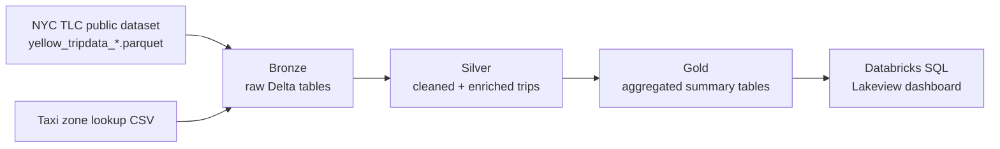
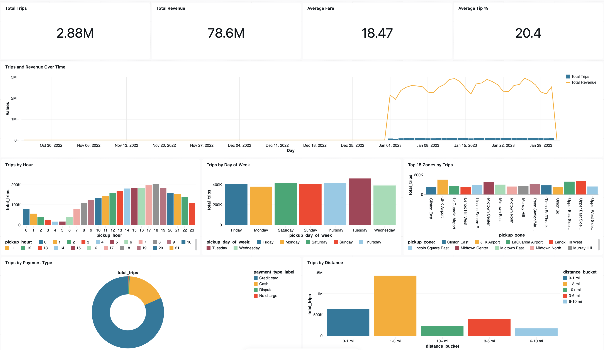

# NYC Taxi Data Pipeline & Dashboard

An end-to-end data engineering project on Databricks: ingest a month of NYC Yellow
Taxi trip data, clean and enrich it through a medallion (bronze → silver → gold)
architecture with PySpark, and surface the results in a Databricks SQL dashboard.

## Architecture



- **Bronze** — raw trip and zone-lookup data landed as-is into Delta tables.
- **Silver** — data-quality filters (positive fares/distances, sane trip
  durations), derived fields (trip duration, tip %, avg speed, pickup
  hour/day-of-week), and zone/borough enrichment via a join.
- **Gold** — six pre-aggregated tables (daily trend, hourly pattern,
  day-of-week pattern, zone summary, payment mix, distance buckets) that the
  dashboard queries directly, keeping every dashboard query a simple `SELECT`.

## Dashboard



## Data source

[NYC TLC Trip Record Data](https://www.nyc.gov/site/tlc/about/tlc-trip-record-data.page) —
public monthly Yellow Taxi trip records, published by the NYC Taxi & Limousine
Commission. This project uses a single month by default (configurable via a
notebook widget).

## Project structure

```
notebooks/
  01_bronze_ingest.py       downloads the month's data, lands bronze Delta tables
  02_silver_transform.py    cleans, filters, and enriches into silver_trips
  03_gold_aggregate.py      builds the six gold summary tables
  04_data_quality_checks.py asserts row-count reconciliation, null/range checks
dashboard/
  dashboard_queries.sql     one query per dashboard tile
  README.md                 step-by-step dashboard build instructions
```

## Running it

1. In your Databricks workspace, use **Repos / Git folders** to clone this GitHub
   repo (or clone it locally and push to your own GitHub, then link it).
2. Run `notebooks/01_bronze_ingest.py`, then `02_silver_transform.py`, then
   `03_gold_aggregate.py`, in order. Each has a `year_month` / `database` widget
   at the top if you want to point at a different month or database name.
3. Run `notebooks/04_data_quality_checks.py` to validate the pipeline output —
   it asserts row-count reconciliation between silver and each gold table,
   null checks, and range checks, and raises if anything fails.
4. Follow [`dashboard/README.md`](dashboard/README.md) to build the dashboard
   from the six gold tables.

## Tech stack

Databricks (Free/Community Edition), PySpark, Delta Lake, Databricks SQL /
Lakeview.

## Example insights

Built from the January 2023 Yellow Taxi dataset (2.88M trips after cleaning):

- **2.88M trips**, **$78.6M** total revenue, **$18.47** average fare, **20.4%** average tip
- Demand climbs through the day and peaks in the early evening, dropping off overnight
- Tuesday is the busiest day of the week; the weekly pattern is otherwise fairly even
- A small number of Manhattan zones (e.g. Clinton East, JFK Airport) account for a
  disproportionate share of the top 15 pickup zones by trip volume
- Credit card is the dominant payment method over cash by a wide margin
- Most trips fall in the 1–3 mile range, with volume dropping off sharply past 6 miles
